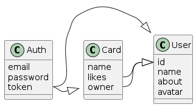

1 Результаты аналитики клиентской части приложения MESTO

1.1 Результаты доменного анализа (бизнес-аналитики)

1.1.1 Проект Mesto включает следующие предметные области (домены, контексты)
- регистрация и авторизация (auth)
- профиль пользователя (user)
- локация (card)

1.1.2 Взаимосвязь предметных областей (карта контекстов) изображена на схеме


1.1.3 Согласно схеме операции с данными пользователя и локации доступны только авторизованным пользователям, которым выдан токен доступа. При этом между доменами пользователя и локации есть связи, определяющие владельца карточки с локацией, а также список пользователей, которым локация понравилась (список лайков). Владелец карточки - это пользователь, который может удалять карточку локации, которую он сам добавил в БД

1.2 Результаты технического анализа

1.2.1 Анализ UI/UX приложения показывает:
1) секция верстки с данными пользователя также включает кнопку добавления локации, результаты работы которой приводят к динамическому изменению списка на UI (связь доменов через UI)
2) маршрутизация приложения разделяет его на три компонента 
  - приватную часть сайта с обслуживанием доменов User и Card
  - страницу регистрации
  - страницу аторизации
3) в пользовательских сценариях активно применяется паттерн "Всплывающее окно"
4) данные авторизации (email) отображаются в заголовке сайта

1.2.2 Анализ кодовой базы показывает
1) стек приложения - ReactJS
2) есть глобальное управление контекстом из-за связанности данных пользователя и локации, отображаемых в разных компонентах UI
3) методы апи хорошо изолированы по доменам

1.3 Рекомендации по рефакторингу архитектуры
1.1.4 Исходя из проведенного анализа рекомендуется вынести из монолитного приложения следующие компоненты
- профиль пользователя
- список локаций
 
 1.1.5 Вынесение списка локаций в отдельный компонент позволит масштабировать список независимо от других компонент и тем самым снизить затраты ресурсов на производительность списка (стратегия Изоляция). В качестве стека рекомендуется React или Vue, так как они являются более гибкими в части управления производительностью

 1.1.6 Вынесение профиля пользователя в отдельный компонент позволит дополнительно повысить эффективность разработки за счет независимой фокусировки на слабосвязанных бизнес-контекстах личных данных пользователя и данных локаций (стратегия Вертикальная нарезка). Стек может быть любым так как специфических требований к UI/UX нет. Например, редактирование

 1.1.7 Регистрацию и авторизацию рекомендуется оставить в основном (host) приложении. Данная бизнес-логика является довольно консервативной и практически  не требует изменений. При этом UI домена авторизации включает базовую верстку приложения из-за отображение email в заголовке сайта и переходов по экранам регистрации и авторизации через маршрутизацию верхнего уровня. Следовательно, вынесение домена потребует изменений базовой верстки, которые могут нарушить обратную совместимость UX

 1.1.8 Выполнение рекомендаций согласно 1.1.4 выглядит технически сложным по причине связи доменов пользователя и локации на уровне UX  - кнопка добавления в секции с профилем пользователя управляет перерисовкой списка. Поэтому требуется дополнительный технический анализ. В рамках же текущего спринта рекомендуется вынести только карточку локации

2 Планирование изменений

2.1 По результатам анализа планируется разделить монолитное клиентское приложение на следующие модули микрофронтенда
- хост-приложение с базовой версткой, регистрацией и авторизацией, а также управлением состоянием остальных доменов и отображением списка локаций (mf-host)
- профиль пользователя, обеспечивающий отображение и редактирование данных пользователя (mf-profile)
- карточка локации, обеспечивающая отображение и удаление локации, а также добавление/удаление локации в избранное (выставление лайка) (mf-place)

2.2 Детальная декомпозиция по микрофронтендам функций бизнес-логики(БЛ), а также компонент и методов АПИ монолитного клиентского приложения приведена в таблице

| Микрофронтенд | Функция БЛ                | Компоненты UI                        | Методы API
| ------------- | ------------------------- | ------------------------------------ | ----------------------------------- |
| mf-host       | Базовая верстка           | Header, Main, Footer, ProtectedRoute | getUserInfo, checkTocken            |
|               | Регистрация               | Registration, InfoTooltip            | register                            |
|               | Авторизация               | Login, InfoTooltip                   | login                               |
|               | Список локаций            | Main, ImagePopup                     | getCardList                         |
| mf-profile    | Базовая верстка           | MfProfileApp, PopupWithForm          | setUserInfo, setUserAvatar, addCard |
|               | Редактирование профиля    | EditProfilePopup, EditAvatarPopup    |                                     |
|               | Добавление локации        | AddPlacePopup                        |                                     |
| mf-place      | Базовая верстка           | MfPlaceApp                           | changeLikeCardStatus, removeCard    |
|               | Удаление локации          | Card                                 |                                     |
|               | Добавление/удаление лайка | Card                                 |                                     |

2.3 В качестве стека выбран React и Webpack Module Federation. Single SPA не рассматривается, так как его применение в данном случае (на одном фреймворке) является архитектурным излишеством (ключевая особенность инструмента - применение нескольких фреймворков при разработке микрофронтендов)

3 Запуск приложения с архитектурой микрофронтед в локальном окружении

3.1 Перейти в каталог проекта

    ```shell script
    cd frontend/microfrontend
    ```

3.2 Запустить проект:

    ```shell script
    docker compose up --build -d
    ```

3.3 Перейти по адресу в браузере

  http://localhost:3000/

3.4 Завершить работу всех контейнеров проекта:

    ```shell
    docker compose stop
    ```


4 Схема разделения монолита на микросервисы

[схема](https://viewer.diagrams.net/?tags=%7B%7D&lightbox=1&highlight=0000ff&edit=_blank&layers=1&nav=1&title=%D1%81%D0%BF%D1%80%D0%B8%D0%BD%D1%82%201.drawio#R%3Cmxfile%3E%3Cdiagram%20name%3D%22DF%22%20id%3D%22BleSmaJVXqo2yb7Co1eL%22%3E7V1bd9u2sv41Xmv3QV4EeH%2BULfm0TdJm1%2BlOm5cuWaZtNbLlSsrF%2FfWHN4ADYEhREgmSMpou26JIigJmvrnPnNmXj9%2F%2Fbz17fni3uo2WZ9S6%2FX5mT84oJW7oxL%2BSIy%2FZEer5%2BZH79eI2O2YVB64X%2F0b5pezol8VttBFO3K5Wy%2B3iWTw4Xz09RfNtfnF2bLZer75thEN3q%2BWtcOB5dh8JN0oOXM9ny0g57ePidvuQHQ2oXxz%2FMVrcP7BPJl6YvfM4YyfnN948zG5X38Ahe3pmX65Xq2321%2BP3y2iZrJ64Llcl7%2FIHW0dP2zoXvPvx5XH7z3J7ez3%2F9Mtvm7dXn37%2F34g97dfZ8kv%2BjfOn3b6wJVivvjzdRsldrDP74tvDYhtdP8%2Fmybvf4l2Pjz1sH5fxKxL%2FebdYLi9Xy9U6vda%2BnUXB3Tw%2BvtmuV58j8I43D6Kbu%2Fgd9XvkX%2B1rtN5G38Gh%2FHv9X7R6jLbrl%2FiU%2FN0Rte3smpzMRsTz8yPfil1zPD%2FfiwewZZSfOstp5Z5%2FQLGc8R%2F5iu6xuuzjhNX1lvEHXzwLa%2Bz98yUhg4vH2fp%2B8XRmj%2BN3refv0k9ix7%2BSBbPiddmOFvGuJEuWnDwq3rtbPW1HX2frxSz%2B%2FfTlMVov5tlJT6v142yJnBXNNtvRbBP%2FvePE2XIbrZ9m24Qj0RM%2Fx28vnu6zd2dftivw3up5u4gZa7RZ%2FFt2yl00235ZR6NNtN3G55R9Svo428XqqdaJ8e%2Fn1WaRnF9yWkyc0Xb%2BUPZuCkrJW8Rhi7xcPEUjRkXyVfOMypPD6%2Fub%2F5AY8S7Tq9nvH8AuzpaL%2B%2Fy5NtvZepu%2BxeghudlyttkIRPJM4Aneff47JaubtXwkJtzn4lgpa5O9WfvqyvcvrhTWflo9xZdfzNbzHMxj1myEyYlDRR53Q09hceK6KofbTlv8TUr5O6EclMVlkgpykirb0QU78H%2Br%2BBnf%2FDZ%2BM%2F0lvm4C9neB7Hn2%2BSXbnhCeuLc5FU7m8f5E8TZeJPuScOs4f%2BNxcXubXI4SiUhGXNBZ%2BdfNCYHa7HX%2BJIgI258qXAn5PStQqYKGKlU44fFU8eHa%2B%2Fvqn%2FEi2l7Pos8v%2FmLx7nrERKhBfYP6BvWPVe0IMxg47BN9qI%2Fzt60R9d%2B%2FbB9iCjZgnxGD40po7yjEEOjEeuIZrDdYb7C%2BEawPGbQz7rZ9lb31Yj3xDdZ3g%2FVhYEnEEPgdY71jsN5gvcH6Zrw5viOBveOGXYO92wHYX13F7Dp%2B%2F5OB%2FZwufAn3HZ92jPvGn2Nw3%2BB%2BM7hvW1T059he1%2F4c0oU%2Fx8C%2BRBaSH992VDe%2BXtQ3sVuD%2Bgb1G0J9mylRXKujan6GZtjXGbw1sF9CF4oVaKtBfa24HxjYN7BvYL8R2Kc%2Byy%2Fk7O2pxrxe2McSHg3qa0V96oeB7ONxtaH%2B5I8Py%2Fcfoqvp07%2FLy%2FFm%2Bmli%2FT2i5a4%2FA%2FsG9g3s78Xf1JH521P5uzXYxxm8PFHD4L4u3Ke%2BL%2BN%2Bx16ectefgX0D%2Bwb290zVlLR9l2iEfZS%2Fy1M2DOprQv0RcaWIrkv1of7qIvj01%2BZj%2BD36%2BO7n%2Be%2F%2F9T5d3Y2Ihan7pay3f9lbRG7dyFdYL34n9Hx75iWSZPV1dpMvcrw%2FUUxx8PVqO9uC17fRMoKvo9sFfLlczT%2FzR81LIcHbDewicWTmJh5itNHQDRD2DhuosPv8ZvXnL9efFn%2BMyE3wfjG%2FWf%2F8GeXvYyAUoKLmPZIo6M5N%2FmEUdBG4jmvxd1hVKmNdcGb2X1M6vSXr9Laaj%2BcEjrr7PnPpNr77LpaZYba%2Fhe0nPrXl7UcKbCm2%2FSyh55jtv%2F7t4n%2Fvf43evf3wEkTTX6%2FtPx%2Fejspzc43ybpR3o7zvhe%2BhJN6RyprWVHeUu8sDcUZ116S621SS%2Bb6%2BFHxU4NsWlpVjJH4LEt%2BmrHcLL8AIVUhAJb7HyKSF%2FUeSNuL1DUny8yJIf16An9mRSfrTPmlWJawUsaiXURU019HJrTTAnO6GW9swz3xPTptHEmlw%2FZy2ZZ7FD7V7%2F8VlouJ%2Bxyz0nJz3%2BP0%2B6S91frdcfZs%2FxHrc%2BW2yt7NNPU4cmK8l%2BU%2FcTELU2hjHsRFtjKloLWxmDZ%2FZqW1mOXc3sM3ED8TkN3YLsMm2hXAs9RtA7A%2F%2FerPp78672dO7l9mcrp%2FH%2FzyNiNWeR8VFUPTujs7R7mC33o3neg1pMn4gdQ0gHhKPdgniuaRMA25hqdXY44cv65vV%2B9nLSSsqvhfIu%2BGqZgVhOmTjYWB8M9qzK7qj%2B4DIK%2B2G6kqX0H0TETl8qVUVPrG6362eotMm%2FIBaNbaDsIxoTYTfXgSlQ8KX84%2BIiwQrXILJVqc9wkcUqJjyxlfARnXSn276c3wWL2hAzk9dINTbLR5Fbpov5m9u7heX7j8Pf%2F30x9PFryT63Xkz4h3jGuMLhRMir4QT%2FPDGakjFRNYWC9tRbG3t1tbWriFsN5%2BzmEFKgqsv2yQkcMl7%2FDK6BMsW%2F7tKHuIiNi5uF1HxXu4yl9Y%2FPX2irH9%2B8u1s88DNAsZIb2c30fI9j3VMblbb7eoR4bTt6hljSEgMBU8RKvFU8pGzzXP2Re8W35PnuHheLZK7TL%2FGN9uc4fbU7NvGOb%2BPZmuFnxugJMdS1DaHIv03Ea2NNOANLCGkEm9ghqhThqgxiqbHLyhD1%2FiIBfA2YOfEP5MYUnrwCrgRreKE3NXoaYZkSDFNeXgDWwUHeo6kbGFtk%2B0Gorolu9q0DdoX6MU6GOmGXizh1UDv0KDX9juHXsRuyKGXg6sLIHaaKbMAjC0AySoAqyfzE%2Bz83Sqc5p%2Fu5cdPAK0RPMHQmlp60XqvVMohoXUPFOU68ROD1r1H6%2B4VZSRVrjFFeQouvATQO8nR%2BrXhtKJV26hWzUfc6MFpx8RiD2JnIudAEQfJguJTfkR%2BJm3tJpr5bHJfTz33tYWc1s1zvDd1kimpQCLgITgQY%2BRjlaVguqkkGFMgYyzgCPfBkcwR7gEJdHWeXrzLQnAnIGkz%2B6KdJfReBMk%2FTI%2B9upqEXkOhD4f4dbwOPJ9ECH20h1amzNag1WtGq58mBotSLMIyPfRikWcmdrxGLDJVQ610cfc8qaMHoToLh0pYvEaQ44i089qp4OTS9S8L1xlMBa%2FvxEjI%2FWr2uFgmK%2FxjtPwaJeed4a4xLLtcNrEb2XbXkbcdqwYmyLZ7pDUXh6ezf%2F9v0Wwe3%2FLqxw%2Fv3sa%2FLq%2BvTdFYThyhJxOHxrqxEtIoD1dxD6alBKcSrE8PToDvEiZnQX1wCvTBCTgSniEO0OwTQ%2FBZDrttqjaeNH3IEx4Ipap71A605nuxIRMnF8Zyuk868E3SwSmEsZzOkw78EhSHVZ6BaH7zIxCkVY%2Fh6876QvMINGd91SkvOwaAJWVcAoBG5Jrc7DhkmRhCQRei97QIvW1kEFyl%2F9WGXn66gd56hBQ6EiEFTFnuDnlLEgh8AJQw6csGyEsUVbkeIhfXXjF0nrAsgX01ardj4C7joGb0aQnQg9BF8w2wzmzt4TnWv2VYeC7bKX6IFejqxfMaZSkGz%2FuG53IDTD9QFQO9eB4gJThJgEtN3IVBLXqQPg1Pjv%2FmmWQZdGcnvx5w9gMPU7Y9pBaxPXBmjQeGDM7S4CBiWYgTSS86BzWcSAade4fOEiWFSJ8rzeiMOMwKdLZAygHPt5XqJdBEXSlLAdzqhPFX6f1hsR4nQg4Csr8twm%2FTRff14Le6O1UrqBy6qs9QNyjX6VtkQLnvoOxgHkqtoIy40o4FZZCrWqjDNvOgwOoJ2NowYNfSEh286zKKdhVqKeMkJpXuq%2BACxD82NIVaNlJtVQ3SDd01fEgGunsH3TIhYaN%2B9UI34jXL6wc4fvqiz0PVni0AzlKOL8j%2BOGHgDZR9DTFPht6ytrDpxm3dhw09xDuoGXjDGv4hA7x9A145bMgpqzPgDRGH2EStOy6DXBhdvAJa7ljUjaWo4KsHanlSk%2Bdj8UDiteTzmJDLD09%2FP37%2B83fr3T%2FOOLz2buejph3OKCiUYXcjqyrOvyEWG3QFjQ40ZaYBlEaX1DibB4fRjkUkKvL1RQJRIiqvzDw%2BZT5RsR0AxpOy%2Brh%2BZMnrxGjJK00sT7WR%2FJbyNVA6KB%2BUaariTFVcC1VxObzcZQxZnPdh8RjvGbV%2Bib7FP39bPaaVsgi0hJkmlzlYWZYXzFWglqhfwuqM%2BITM2eqWYk%2FLpXo35Pb2rojEQLXF8u2wKetS8pYS6iFJ3EwqNV2BiyJN03m%2B1Q2nDynOa2DdR9z%2FzBHeURHetpGFJ04Dw1LRlS%2BvfK4r66ldJesJkOkw7uGCqIiVfIXiZNhiigqX91IlaIIyiDRpL6YM1UynlqdR%2BDfd67oHPeDjZZaRjyDZmzYyQ4c4DczQwY1gzFlZp7HFN1x%2Bo2KRAkmXsZdUHpPVJF4BRwzP3%2BYsO2FFL%2Fw4EeoTJ7ywkb9Vh5XFvhdaWVnvzHNe0VhQH1WpL0A0%2FCZKHHHiw1wwe5p6zk74H6emXlYuleRR1UNx03gOiwuIFMS7nUPNzUZ8BUFbvgJGwsZINEaiaZ1yrCuQJQsXLiDEMnMxy6yBxik4f5c7A2v33ardP4OJDB71Yd7BXDOZAlseRnQ8YFJAlQYa8lj7jdeiejiyxW%2B5iNzwkEBFe5qHabk1bLnRmy5%2FzTTzO17r1e%2B2hA5LaGNV2Hn85BomGswj3ekQfRXdC3lDAoajNlLNT9HxrG15TkmNJNPo6Xa8XqfSJuW5BPTgWooLP%2F%2By%2FsrNGNUIK13G6PY%2BqlxEOGYPETXs2DpaxgD2NRJujq1b%2FgnvkwAukHWyjcStbHaPzerLeh7llxXLr9zJ83fdKUa1%2B2ir3Cle7GQ8Hz8tDTFvDnjkgjCyWxZkwpf1CMrBEmn3REFaYfvvMUjAA%2BiGanF1hgokHz57TGDi6WbzLIIOBlq3i68Ho3%2FV96471GAXogrPJ3N0zGtp0sShCip0dSR8npNofHP3ImlLuzvPoRqNZEhNLEboEDnLm%2BOXQq11TkJbYotG8GFERVf7yJZcI6u7u1h1UoC5CY7DfOpNUZ723uk9CsEsE1a4mM0%2F36fnyflJYs4GVxUaMdil3B1e7rvLsGotbkNrJD%2FvpxDwlK0ix25YCoHsdvcOVQikbHf1TnsrBE1DDC136O%2FdJn2nUGedGgp8QVs%2FcNHHz68IHXH5CYU98%2FvU9Nz0QDqWIcnectD1vPMwdEmQ%2Fy85CGl4gAAU5Z%2FThvxDp12XdOobA30pAOQyYcavHBjKYz9fHpfj%2BXYFd3LPRFJAHGgibAv5%2BERMGU7mvauRfg%2FpkcxnwLcwhLxViSFn5PZdXpCQjXsvmiG6knu9rsRA7kWZVtuFzPh7%2BvmPp7vN9%2F%2BO%2FvrJWy9Xb6ynvxC2JOr%2BL5eL59KgKgRZOb9a0txKAixN6GK%2BuNTEJmrwhCK5HbSB3Cp0YcvV%2FXZCJyFsMQ0LzqXmeJholY3SoYZLrCYoSc7Eti2kWtVDwnBNhEs%2Bv1n9%2Bcv1p8UfI3ITvF%2FMb9Y%2Ff8YSJJvSxnq6kU3EvajFWnhzZcdWi55ctmtadrKOtN3LE16vKqf1mtVCa%2BGOFWYc66hZxdcasYYmUke76q6kFlaYImHpwbx3pZn36haztEgiUuM720cb3zGubdphghNJ05NhOuA8qf2JjaCcZs4rsfXESRqFxedUchuqrcBAAVdwCHgLMiLMaSXgQnUEve45Gz1gStkhbltoq%2BCWSoNx%2Bhl653eVKWmoxoo1MyXerSpE27lK0gsVgbBt4BiczEs7QTThtXGVXHBPA0TQMarWwlOob%2FgYnhJHoOnMpa5d0VXR27BsNloTu%2B%2B7oqJjI836HYrkibhMQ2p%2B9ynO%2FH1pAKrXMHRdkT15EX5ndiHFNaaqflRleRLlW%2FoqodiXZs85Ltr6pK0eVbg%2FB%2B%2FmG%2FaxT43eSXCuLXnMHao2VdHLmi7CmkZwtiE4QypbskgdLCo4Hb%2BBAk1893Hfa1bUdgG9Oo7ifofTIWEOrm7Pj1YW9qV0xngTVctHLwf7Tau%2B2s1JP5QCx917V%2BuMx2x7hKNpNrUfHdmWbJfaGrtN4WRUogpBNCVAi63om13R%2B5pdu98IGuPpPxCuAqmpWUxmyMhZlj6nReXGBoUOXQbobMeNL2obgxSMDNAtA6hKR3plQIln%2BgAZUHN2gpEE2rwvcloAVU066iN5We1JgqEPZlAlARZd0CwJ2pjLYCSBZklA%2Fa4lAZI0OeHj3KVZOpJXZV9rwKD5AXq9NPCBYgVPIZK%2F3hqaY2NLh47mtmos6UXzOsNADZr3Hs0p0j5IJ5pjw08PRPOaer3B9APgR85UsikWINWL6oPPylRQnXSeAFZnxmirqH4b3c2%2BZBUwBtNrYro8q9ZXzWe9mF4ZD4XJKRcGzbvPdkmG3WJoHmDA0xqaY93eBo7mDiYkNeN5DUeWwfOe47mNjarVi%2BiI625vRDfeFg2%2Bc2KruXAE6xjeHpJjRc1DQvLQk%2FILaaBxHD26pnXmlRoY7xOMEyr3daB%2BxyCOjWedwJ4AsLhHinLC2h200GeiYPSUqevp3wbiD0Yj2fcSoJPrqc7iO2xC66AwPhacYvqRg%2FS71ozxNfxZBuP7hPGxqi6afA5LV%2BsM4k2J0CsqEQoHXwKtoDDS6kwzCtfwQxkU7jUKu6TjfPUQcbpNpKYyjgivkuptYeqwQeqamCIaXq5lY0jtIiVi7SF1jdS3YSG163SdgBLW8DMZpO43UruIs1InUhMLcawJCnM6DqWAZAjDFXMIDCRXeqldbLgUbWl2bcnGn0C9p4TIYddeamLVcAsZSO4ZJPMgdU5HnqVKds2gXFLv2fi4GAPTlTDtWVibN8I6zGsC6hMoyhSB2nO6rskkVtdFmQaoGwBqt%2BOAIrHwosyxpWAp7DUeGlg%2ByqHhOQEGy0VPTj3APPiuuKEnJ%2BwhEXrd7ahN%2FvXAgJlQR07B8jqukCRYb9zGMj1YrX3%2BsrpQR0X54EwYLqu2V57mHydcCB%2FAiAcRxaSSLuKjzZkdnfkhBB3ePSThEEtdKkrdsGuHN6kzydeUXPZLPMR6u9jo17e69nljY30nfMQ47HYCQ5U8B88qSe8mYoKfNCCcywvYbV%2BagJuN6H1V6B3DTCiRB57sr7P7CUHH0A4JvW3bEdF7ZCNeTc3wXWfuqoHvnsG3RyVCokiYRS9%2BY136J7xkHqrMnqB3lyaWSFheDs8hAd71CSjTnGLoLsVNJXti%2BsqQHoMkrD6QOlqhnpH3CUE9RbJwdUN917ncBuqbgHosTUEv1Jfkc2eo6zNMzoYg7wXdHKvDPaHben0DsGKIkWtwXL97LZ0OPf0bgW6iGse6obvrBHAD3U1Ad%2BdJLBRPAg95e1rJ4a1603dOFjUg3ygY2VIchxIscVy3fj70zHEV5Pnw1g5BvuvccQPyDYA8H7DeGcjbePp4WOZEV6OdO7uVQ7d6AI6wQbc8DFucD2%2FOb8j6ae0tCMJXJwgUwPIwbZ96WgWBPfSEdWRdaef5NnYN95cRBL0XBKTrjBu7JGW9QZ88TNuREm14Q0R%2BlVqtJGXNvHptX27Pw8MqQlMVvRA%2F9FR3FeKRVqS6Eb7rVHeD8A0gvNd10oxdMn8Iwqo6KIhU6vXN6umvEMIlhw1zvwtEgoFNewg%2B9LlBiEu%2BewQ3c4NOAMGRyI5mBEd8fs37agymNww%2FDuZ6sbQmszs1Evd6jerEd%2BSB24hCpRnWHTNAaHCwTi1b4k%2Fb7TrQyhBjj56HqnOFz5xAvSPT3I%2FyusA4Rg2ptMj20FZaRKuXxBl63SmCxhQr2dKNx12Xnho8bgKPrbDrYRHEwctPj%2B1%2FaFD7QNQmSMWCp7NRLXGGXg6qYjZFvE26EdvUg54AYmPlCprxurIglCgBRVi5X4HO0kgItVgIpjleAawfg4gmvw%2BfEmRAvw7oUw9rEkOZ0a0J9odeR4rAfvc5K66pIz0F2O88Z8VFHHAC7KsYzpPOy7p3VXjMpYTFejCeI%2F8rA3PG4QXooI0YtQ7o5G0fBwvm6lw3llPZIZabQtHBYTmhCH92jeV4oWgDHb%2B42g61dYjxE%2BRWBuP3nupGPUxfJzondxL%2FBNw0clpn924a37hpBofx1KIyIXXupvFLhjDvFeg82OcCM1a4GcBGcsqiY3pGvdljQhZPN5tnviWvBt5jHApk8kH9MWxigiZ8PwF%2FjNxslXY%2B9SIw%2Fpgh4rtMSKTrsGmA%2B2OEsKkNQJYAfC%2FrsqU2zVVx32LVo43g%2FmvDeck%2FTGj305lJMHRXjYrzQeeumsC4ak4A5v2uPTVBiaem2ut%2BTLq5gX49Kr6PenBcrYk22OhZBaTSFfmYPyMVt0hmz7vl6tv8Ybbent%2FOtrOb2abe7jyuvs5u0g9MXq2jzeJf%2BHq1TW7GX99Gywi%2Bjm4X8OVyNf%2FMcW2ewSl4W9zheO8vAtdxrYYQRJ7eNEKmO%2FBKNGGTmWXSwi5jdpyXTu14Fvba%2B%2BfLKjn6OFvfL2IGS6Jv1vN36Sex41%2FJalkJy44W8T4m65WcPCreSxhs9HW2Xszi309fHqP1Yp6d9LRaP86WyFnRbLMdzTbx3ztOnC1jPHiabaNNyYmf47cXT%2FfZu7Mv2xV4b%2FWcYsgoprGyU%2B6i2fbLOhptou02PqfsU9LHSeRkrRPj389crqKnxZSZ6QPyu4leMGLEIr85zyg5Oby%2Bv%2FlPEidOIL%2F4%2FQPYrBxSx%2Bm2x2yavsW2PbnZcrbZCLTwTOAJ3n3%2BO6We5KlRAsq%2BTgq34%2FQZcqoAn3SXwUFx7MPiMd5Pav0SfYt%2F%2FrZ6jMlA%2FeQJLKJFJRQXSVBCSSVb%2B9pFU%2FaNYwbMvrS4EPHh5%2BJYg6rzDbm9vbMw1CKWb4cNCaci0SdHLbWIk2CCiX1S45BFsUG7BrIMZDUFWQeiT36TzXPy7kG4l93o548fAHRkt1MQ5RSBxmUK5guDFbWw0EHs9BaRBqsrNEgzHKQp47kThaCJNNn4IjfyC9MdrYOBZnly%2FjnwFYs3Om0A4h6%2FHIBspM8Ay3TUBECY99UAkAGgEwegnyanDjWOmPfnIaXvmqEGi0kYqDFQc%2BJQk94oyyK9ZHHuVwU92BAyotfMwtoFGOgx0PMKoGcMuxdcgpR2OB711CHJkVp1hec%2BkkGlWR%2FCmr0aUDKg9ApAKZ8s5IixsSwR5FUBke2eI0XafFaHJiTCSmkMEhkkeg1I5CgnHR%2B0z1LVThrIZCOPYGH7UK%2BVh%2BWTGRgzMPYKYGy8M7%2F2pNHIccXUaYJ0S%2BBjETShEdYJ3qCRQaPXgEYT4GFyWXqkpDPBlgoTcFNpcOyUNXSA%2BtlpgxnrGsycVWoSN8XKiVrEMpPDbbDslWJZCAuc%2BCy7FMUoeiU%2FwVFg7rUhF9aGItTq2iImv8kg12tFLrRjOb%2BYtUU8bUhS%2FFSsmTjEJAepqm0Rk0wilMGkYWHSmLmRCoyxgVvcOv18ytAXi9RcNakp0IsiJqfJoMiJoQiwt2A7CNifWWrjfOKYI%2BouAZLDTfSaUyZnyYDOqYFO5m4O4aTTAFzz%2BnAnsKVomoPE9plnRRPwmBQlAzwDAx44SgL6a16BtRTI1Weq04V1CNaEHyY3yODHyeCHsZOq9RU2iUDQV7QWdxCT%2FWPw5rTwxthHBd6IbTwCpMDV0uoMZjN9DNwYuNEDNzdrbVx9deX7F6XtcWfred5at7E2qoEnT6Wu2TzDtltj8PJGYTnw7%2B4HF5T0g2M3WrAD71eb7f06uv7vW7C3C2S%2FRXCXtrzdlsqbh9nt6ttZ0ag8JwLK%2BiuzZt%2BkEU%2B8JdqzIwcJ%2FyEpmcxx1jxB2IhBO%2BEDdngrbKkqyQJJamItk5xza7HJPI6Q8pb87bG0kqzMSdp21pT5y%2BNyPN%2Bu4Dbv2d4dUA7anr6FYXlEnpDgIilsHtJAmTityXYHk%2B3you%2Fby5%2B3HL83vfxboCTbZuKBAwZWH6ezmT91TmBgnjSI0O56Xh516vSwN4M2esWc1KISHVEV5DXzJj4ur%2BHx1kpRYJ6Tbgag7gs8tPsBeXxYh7H5jc0%2FEBfjIcMT6iLTyQdVScAGZ79wWFLFlt4eVsw6MhhkMGggGFSEObhDwy4JfEiVyBfgwhC4UxwIYScPQ2q0NUC0Z8c5R7wkLQKRqakxQGSACAKRkiTCexBLRqP0ea8umCvCGWWJItCyY8U2esDMLw%2F2GDAzYGaiufuZTZ5Uudd5MNcvt5pMMLf1YC4JQioQhKNmC%2BqN5QbGk2fw3uB9Qwqd7YnsPQrUKKFmwA9M9k6X2Tt2KLYlGjEB0B3il2TvtGsSnvQme3JQ17FV97iLjfdscZtN3zwj2IfllRr4dL2LIPmnaBvpO67jFu6kjzko2E1ZmVJwjmcGdRecC9tIHNwnN%2Bk2upt9yWZWm8ykWkLMdaQEVJsiMV6tqUkhprsaKuo3FQUiFVEfy1fSTEdYhM7QUb%2FpSEYjFpnojopM1zOjURuNWmcYNkj%2B6deoaShV4RFW5NqhRm2q%2Bg36DAx9TPJsbp%2FLE4K6t8%2BNd9CgycDQ5OAEfh6puFK0mysRleK%2Fp68BjyR%2FIdGo3Uz%2B%2BLB8%2FyG6mj79u7wcb6afJtbfoxp%2BnujpdrxepzGdlPAS6IBLKa77%2FMv6K7eoy7XHeBHXL3%2Fk16Qv%2FkyuOXfZy8n3%2FB7Zq5f8VekubFZf1jmB0%2Fmbm%2FvFpfvPw18%2F%2FfF08SuJfnfejIif27UxR91H2wqMZpsS3d5HldsKY0xIR152bB0tY2T6GgnPi%2B1k%2FgnvEx8A0ImJL0Uyic3GiLO7ZN8%2Bv7AgCfVermedh6KKPfLY1Dp2t2yFlLvFVDB7AaelvopNxYN7VHJJBXnSS%2BnjeWyEH3c%2B5HlcBY1nT1FQPN%2BPw5mAlorkzXMCijUC9VQQwxneJG%2FkyLMLWDOIhFPSsvmNKrAeM6E2AVkApdmXK0HThPhTR9jZgaHidRQvz%2ByGu7pyaolv7l6cuRMFOCQnH0cKleMrgUwG40T0pr7E%2FFHO8rZJpSBtnZPQFl1gpBE%2BHknK6MiVUk9Wd3ex7qJAegMEXl4nUTsThRG4QsduRsoOIGU%2B3i8mOFauTGE6us9I2QHkbrFM9fSqRqYxu%2BUKhdakCOgGTjwly4SxLmbzz%2FfpebL%2FWuQEy%2FJd362Upg3oJpTLR54vQ9TmFRRrqNhEtTNKtpjbt0Glr6R3RfthY09q8T8KkM5CrfW0QJcaa%2FF%2FbJzGtJtpNVJDQlcmI1tfvA%2BlIjzBLR9JRoGfGyI%2BEwm4wsJT3iTrsn4GnNsx2JdxRSNIEihIgliUzH7QAtqYt1yHRVm6nNAyrMK%2BnXYhz63pi2HoUEmjJNSRdMrahmHoSPcK6blkZDZmFnqiF2QUUK%2F64ZQr7HwmTatmYbmntn9mIT%2F%2FMJQ9WbOQoVF%2FzUIpgZlYkorXnlVYMUyuMbOQC2hov6W0m%2Fq9QajcEgkdhM2NFbePFSfRU%2BAhPau0WnHo%2BLD2zbjmOoHF8kfuBOZQZVH12mvYaKSYZ8bQXwJdMtI8YInTKtoAqM1jfXBadnkoencm5a6dEj9NPxX09uhJtv%2Bp7WOt5RykAUF7bNp1U0uTqrkvHakpvyx80pUDgJTrzEPyNB%2BJnFKlnqS%2FO%2BDxWCzcqDjHqDiW6j2lHjJprD3srFF0053ToyQcnrMqdHtUCoa%2BeD1IEJ5bFvXD0HWp5bOlLgwoV1K6avtA%2FNA9l4dgirdqygXiyjF43yfVz%2BZZUhIAzb94qy4QZigMwgfSLIhDWVIhcuKf%2FLTjc76vTtUPwxGyv46YkSdp5TKOtOeJoTV0777JjyBQ5QeeTsWmZPRFgFDWu7Jwm7PY994iw7ac8yAI%2BX%2BSn9qlwXkQBiHxQs93LdaComlxwgfCc3GSC67S5%2BajyrhHPbcl2k20wswDHXQefV9sk2xDK94sO3%2BdJRzagZu%2FLjIOkxcv4MX7aL2Iv3oCqJMjuYYV1tbgmp6pXdQn545vxTScBmTk7io%2BdWKtzIqxmdCQOJ5kYdZmKOLJMS2%2FLaaxJabxPLrj2eR8RpqncLXKNDamgx3jPy3aLyWs8Lj6moteIqkFGbdtZ1vw%2BjZaRvB1dLuAL5er%2BWfOjqJgRzy3d27yr5Jx1QQcSRHJ%2FmvItAwkokbyKRyKOOUcR8qgbcyytKm6%2BROpvBDO5RwzXZSyP8aKwgldujAyoztRQm8DQFcS%2BlTd29YaBeHZbcjWyhsgkj8V90J2Nt4tV9%2FmD7P19vw24dnZpt426ASAVj1DxCISPrtqMgxv0SL4QxlxNL%2FJpnQdvGfKvUyXx6MY3JMYHInDttblEedvLLhtmjzqEuqW7Edlm6%2BhySNOD5gnx%2BC9wfvW8P7o8t4xnBJMFNtg0r%2Ba3JbLMyypBwkycFRvka5Tw21mLIV9JvVKjhzCxIiQz4UY%2BkT24DZXgGPGfxjBYQyFhvhbKovhcXwhCZZqtBOYg%2BGYQHptO2H6dnz94afL6%2Bn4t8sfd5gKlVHmEzIVHEcU6tRS%2FX9aLQW3xmR2I9T3YXqbBZrZFqs7jAt1j8ilTs3tsmkeZ8S6EesNcTgPvjHLDO1wrNUB6GK2mXEAapLqtiM1VaEhQhFa5bpfIxfYyPV9ovJ%2BKO6x76ldHEsEu9fWJper80asG7FuxPp%2BaTdSgzvf1zi8DefvBjpmGal%2BMEGElqjn%2BZ7qv9Er1GskaJscvCbAYETk7GwnVLN40Cw8m1FJ89uPWPETPrnPzatA5BIQB%2Fx0QdGJJ%2BTlnTAfj%2BQ4y8gJus66C2r0Jzo19bxeo7V07ENzavsolJOlEbWdMHoQ1Hba1uajw9GM2m7UdqO2H8Dgch029bpW29GxdUZt1yXu5clhlLlJulLb0fFzBu8N3reG90dn4%2B0etvG6svFGck0WQUwIvTN8iI%2BJGdmGaLNVkumWvDcdBXIHURdRVnROtSR%2Bjfbmhop6TkUWYtNqpaJg6N0VY81JUhsdZv%2Fr6K5Ysqp1krMMb%2FaKN4kjMafDykG7Y068If6YAC%2BxL3YY4lNNWHvciwqFMJ3xiHdCOtI1nd1Zq63adVtODIgcrC2njXTZaKK1XAkN1XBY9x3gpSI928cyM%2FUCfJ2SGgPwPQN4ItEREhbWC%2FBYQGEitWHed0Qbbx1a7QkIDPA3B1BSzyHbt9B%2BzBhEtdVTNEQU%2B8Q%2FNAVNuF2s6SHXHXhTmCn4ScCsHFfpeBiqIJhz%2BDb9tUu2NMHlvqjGEdtRzQE%2BFl5gc6u9%2Fq5qb5ykLxfDy9V6%2B7C6Xz3NltPiKKDyVIDwc96uEnBO1%2BvvaLt9yWk%2Fd8WC1Sy6lrEeZX%2BCd%2FB%2BZTVGrlrnPh%2Bz%2Bie7R8XM1fTVQT3QVhfBp782H8Pv0cd3P89%2F%2F6%2F36eqOO%2BVhC7R3P748bv9Zbm%2Bv559%2B%2BW3z9urT7%2F%2FjFTI7O6Dt19ps30ZhJCCiXmgHwvAZpFWalPYgXSC2CUO7%2BZ2HHuE9BV3pZs55GAYW%2F%2B%2FQUbBUspccKonJkkZrjY3XqWNj74U%2BugvFpXiXG6r2JsUSlYjcWbQ5oWHaT4D3TMDLJDgcNWBRBEjPQ6Yr6M1vKK8mbL6K%2BM3s7vPMVA%2FnMC4KYY%2FVc3eV2UCsBlJddkzaENyUBDQ8p4i1GqYW5NhjVqmVm5KFWQlH%2FkwFy9VMv6iPSQFrecbUQWR0MG%2BZq2n4heow0GEccXNGsGXOuWmzjzWzu3M0s7rAh5TaYEfYRsgs0uvfLv73%2Ftfo3dsPL0E0%2FfXa%2FvPhLe8L27BtpFgJNu9ZzpRc9skNt2O2bckJwwZelNkvygU%2BqehgjlwudUB3axpSjY3WsLD4f48QHE7gGIO%2FfYPa%2B6K2TWViw1JlbcR13SJqY%2Ba3MRWNqfiaTMWmqtZiMJdinKGLDCXDitTttorW%2BIiPlooWmygkrC8HEmq%2Fmj0ulskC%2Fxgtv0bJeWd4HBOrTZRLrBrZdbm%2BLURSlxyC1Dhxa7GFbS93EjRfBDF%2Buv%2BynMWMffXjh3dv41%2BX19emHCJ7l8ejOHX4aiWrZq8BkvYwgSO4uVUOp5LxVCQ4De0SmPNw8mVZiFsdSX%2FSta%2Bh3Jk6JKpA4H0K9ex%2BnTGVLaQSaejYKw%2FC9ZGRoJoHdKOjE%2BXw1r4ZRjwXwmQYKezdBCEpBeteiFSbaJ2ozNqUNjzpXcozjf%2FY2QYcunSp8ulTIBUuwLvSVOROXQNl3NQIBrlSOaxvETR7VOtgYlIjyN7r7NEY26XkrMBTYy%2B6sb2GZWWwvXfYLhMSMixEM7bjfWVC6LC1FFieAoTnVaHHpIwek606PWVId2yZYtRyL8qykjUBeo3E9aEBOlGd4ZoBndawjAyg9x7QLVUz0AvoFDH6mlfWa6dXnDA0M9ld7D3aC5rpinrAGZvWKu9BO%2FOtD0yGKN2K3fOp88XuyXhqYkt5MSOeKLN3YrTrS3WAhEp9hBvKeSCelFnOH7rs2dQrnLD6ihjsJCXGyV3O9a%2BgnnDFWStjrold3qyndnIjFYLQGUolb%2BR4tavlSlYsBVE41YIRrbkMwSXUljRl6UJLnM5ss08Bk5prplomXJgqA4eiO4yOWUy6p2TsXiSZHhjW10uW2IGUMuQnEWrYvzA%2BZlWKAuuchFLhLmkEUmKyl5yBti8pDqu7u03UTnaQXVL%2B1VwIRtFvc%2BXty%2BNyPN%2BuILnsqWcCCkT15BZUQVZRwSHbZUeA%2FPGwZpNOBWEcqQ3U8BKdijbg9E0dkGv5%2FVDKs6irDpDAEmHAcaXHaUobcOX6ZvbMpY%2Fmyh337DwtvGVJ3UAZgjZJrRbI7mt9STWy7n422InLcYZxPZbjcmCGBlKmbyNiHMdFNBnnWMfSPn0mbqO72ZeMNY1bqY4u4Vn2uehXcrpuI9RKKoEholaJSCwdRCqDNZMQ4pma8G4SFEgsNerkAwEpuSFhIxEoLy%2FEeNOuUoJ%2B%2BinbioDYVBRIrMJG8Fu21GoEpw6vayllwh%2F7QwwRs0uxjjVtYQxekrabhnodmAw9KZxEkP6BrcUl0SXtukOskfv7OqKoIxkbRGOHWJSGcD%2FisRFJ1CaukUT4GuV96Et%2BHUJsFKxbSiRByaKGSdGKb7J0PWFtdHVG9c7i6Bw2%2B%2BKLdC33XIYFzz6wbROhlnUehqFNrfhvYkspSsTxzy3LIqFNaEgcz5e8nk35Kh0ixQi9vGVy6XM7RFqCsKJc%2BwD%2FC0oJiNXz2hyV9UF58C7KSqDrsYPSkzjDljuxNeKgxFen6ZIgM9iyhHyKbuDcD612r0XnWjqyrGhOCcDT1QqvkNRplALAmCqh5kvNep3mWZasqQ7X4tQAc2ujLPHdG3oq8IhIoRmkl5Feg7uVPGDjCGvZ5hZVUSRHX6vBXZYDnGleNlDxJgBarf1zgCWUJmchQ%2BNaGWoojEOvPewbzgrBC689%2BngWKBznf6tNpU%2Fb3o9hTRQVSLNAijWFaM3YZyhmYG1AsEbEtCOKNJTRG0P0arijh6Vv8A4d3Q0i8RD%2FrGHNnrMm6%2FLDyIjZUd2xJlLm3Y3OwZQGivq%2BJL%2BWB%2F7WbT32QEsQwwLEQqdNsdoTLYoCVsCUOyx3uE3FvnKz%2F1hZPznpV95cLuunl3fzSi55XD2tNtluIa3tLMEFizalk72zT6ty%2Fyx10x1JcOLd6jZaJgem6dH1Kj6Tv2JL5qaLFh%2BZJH8nJqKbLJIbr%2FSucwk%2FlxHLQbehxW2ylefvFI12k0NYq934OKf85BwrPSI13E3eIOkbRdPd5FjaAjE5nDJhcVbWFTe9XUKzLuuNW3xA3h1XOvACDkDGYt%2BH%2BebSC7Is9uxDwiSM6vJs9vRJzq0ky8otctrBh%2BV57dKRou1v8UaxtGm8qM7W8bf4rhXs7QJ3MHavmGX54XtwlXC73EHsJmDBz07n4LDbvBTH01wz7PZCSAmjNfRjvCQZCPmYtI0d9jFCSEn9mPSlsELiGznBw4MiG7IbyPxaEq4wOGVwyuCUwSmDUwanDE4ZnDI4dRxOyb6ohiayNWBB23JI1rPVhN32BrDhBnR5EwPTVd901X8dXfUbY3CHxePZiBcLcbS2NYEN5%2B%2FyoS1mAlub%2BTe2I7lLPaRsqq1m6jgp1JlfKmSYUUk4SjGLu%2BXq2%2FwhBoTz2yQtbraptw06c%2BxaleexRBPZnSBbbGMzNEjYQBMPfJPNQFUjz7XK83xGx91sLhLWh9jSiq0E65foW%2Fzzt9VjivtY7nl59iYeozs4TahkpEfLWsgNub29qy4yaWXKwMiVBnFTZIYXpoxUZYQfB07lfVgMOBlwMsbGfuwt6pc8Q687WwPL727L1rh8%2B9Plmx9%2F%2Ff0aeoJes8HB0%2BsZPVgqPWi1N1h3MIP2Bu1PVRXdK13stamfYkshGiD5wFrVT6fPA4y5tWKnP8NKW4bXKfALLaWXKj%2FtMn8MM%2F%2B4Pu2GYt61x9pRCYGalloe4bSLpV33hXaPr73J7syzdnf232KZwAd0tjRsUJsNXCvczQYBkjjeHhvU8GHv1waEVwtgqf2la9iXVh126J6HoRf6duC5JGRt%2B3jJry23Dq3dtsMOpVa9oWw37t2ao%2BleAA7mTnrFxECdYAcxhAcSA1WmhXvHTphovHNtiGl3DerRHQ6LlQc1ep1XgYWmCmx4VWByH8%2BRz9i6szqwEK8Da3ug4JhNEe9W5dNdwkUsKSQ08tEi3ZYquErmMtWAkl5X6dpU1JQcDymL04zPbp1cD4PPvcJnbl3xviAaO%2BSWkBGSTZIBZ2FXB8AFNWYeKdigG5r9YtXu60JfW6rCRqb5hi25lEp2t4b9NCjkjY3h7pG3RpMrg7z9Rl5iYSJcc4cEpLNXLei1wcEL4Be1XxvcSsmZYYjsadBSC%2BOSPa3RxHhQgEscrDG07o401CDu4BHXxXqJaEZcpBQq8RU4IJTEQ1vovEo4PZUFynKfA4dkNs1SDqyp%2FWygZ0PqtewDXJceSYqwvVJV25Za1SAjsfiYLC2BK1fdgqJ0Fy%2FchYuawpZYsputdFGumxfrCnualekm9bNpsDCr0c0naWb1ueAFm6rZRi98th%2BwFf78zc394tL95%2BGvn%2F54uviVRL87bwou3BlUOTZakmYkQV%2BYSwPxJg31nvcskRhHTl4GWj7B06OVV7TTe94tLwVtLMXgABBL0xCQLANR%2BRWcwFKS1lhBRTj0a5prx9nDmOyA%2BjKcynTtIijraUXZoXd8JJ48yz62RTVq2PiqthHs4zqAUbDbULBJ6CqExLijs8lOJcG%2BprzJkr49NEdII%2FBh%2B%2FKue6qbmdo6ezRiQQQNoNx%2BYoaK1QQZkaEZq9uYjGmwWjdWE4LUamrFaiSMMak5f9cDSj46iD5gb8UXOqJXJMtXVz0qFtLnv2aycHbPE8b8wFWoR83r0Yv5WPTiRDCfyosdaMzGwxe7RljBYH7vMF8hJE%2FlWq2YjwVSEsyfACC9UrR0tO06FVX3rIjOVXw4DvgJW7x7oJLjpNX1QM7RJj4SBmHdYpqG7vHa%2BvD2fvXu54%2F37t%2BPzufJ%2F4K7OoNWe%2B1CGRFH8kthjS9aQ2h0TRHGOhqgTYSy5WxpqeTBRoqf2oJnlIjw8GSRKm2BelHuKIFzrdBZq6TE524LEF83u7qXSN0e0ti2TCOYCG9J8V5dBJ%2F%2B2nwMv0cf3%2F08%2F%2F2%2F3qerWkjTyphsHmk8A2HGcxZ0xAONpVsAw4nVxT4wnliFvD0p0Qp9yVSzLYkQ6pZkKeqj4%2FF04Ybjl6GrlI1Ylc9me8GRF9iWLXHCcfFOlFXKw539m7UNvS19wHmpimbwk7grsbS%2Fk7jdUEIBv41B3Oji1IgJtipoyB6CJu8kn5zo2fSMd5G3JyPr3PL5keLqvH08eFW0jt9DeOEpLgEivFAxx2vreyK%2BKPd18ZwZ98D6cuq7EuYzAmpYesUyV8rzCfNeGq0KF6z%2Bqq%2FCRXLf%2B8AL74JmNBXCpTpAC%2Fp1FKKqRpg2P%2B00hQvDzx4LF9GNIrd%2FaE%2B0lLcwbioPLaxWcKzzVL3ZpTKZXLHapnIQyoXHvmophy11kkGJrEaZ1rAM5co43E5Vg7DubD1RNYjnSGKb%2BhIA1e5e4hFJa3GCsCVbmbi%2B9FmEVXKVPp7rS%2Fa1k%2FumW1VQCBah7bGGApuT%2BSBsZJVoJcaKlYCux4qGI%2FGMF2ozYwkW7upC2YAN8caCx8aoGfWDNq4jZ1JRS03P0KpokPY7N4YqFE5Y%2F0YIiDBxqtpqy%2BLuB1ttriHa%2BkRLiawAcJcFzN9iSKWHaBvvs6jFvQdde%2FlVFX69Wmp1iQsPqWdD9WoWqOqLWh3KyYKB3P%2B9vgdPapLLVd%2BmPXi%2BVCw8CoNwx6MR0bno%2BESDRl3ut%2BilRn2Mz8%2Bq0aP3NNVpjoz91adHsmvdc6XK1hb16fIRP11qO9X0aio%2Fj9VYiIVUvmhWWUIUW%2FpYYZ%2B8kOOJIEYZEgIVmWTOtb1DlUFDlEcW8uMzfmhNxYdntjRXyH9cYlS5v6sXDfR3iVMDT%2FW7f7hSm1PWPkFIy2N6r560PNpv6rsCNr46oMEzNLg3Ddq2ZIJQ1Q9F7JaaI%2BA0qFZSaBWQlg%2BN%2BkSqsdc7s3YSj51g2ttewxIRE8m1pGS18INislKe9kVKOp3SyB5OnyOVm5KYWF3tpvboh%2F1MuX1dIzaVHB2%2BuyPTVr7Acys8I%2BrlJLSky%2BvNgWjKvKSDGINk5GhzcpRKYy19pMkQr8PQI0fNiHXwnplrOYC5luPqcJ1VCkctz6a8CJJ%2FlRjSShm%2FHYqgQpFstNZmU%2BKgYkajG1AZGKiU5w%2B8OjgRlWob696jF06w9FYDJ8OBk56jxm4ry1GsrGPmcpd7x1%2FZVG0aSE3nAgcbq41kkLSGNXZ5ZMVgjcGaoWHNmCrZMRMsQqf2%2B%2B%2Bb0kMs3w6jhlQch7mG2TgVCxvYoBd41IYjvQ5o7Bd9AOEP1w7OhPAHiUG%2FyZrlDsIUZQ7mQBRvihuvbnqiTSWl3PGkJKiG0hORRyY7nkyaprz3BXZerFV6gRPaVRe01E%2Bj3Obo3jffQhdp48XfIxou9WSzscnDLDVZixffwbRWWZocnuHO0ZuLhQK9KT2o40QheGCmWbXIKd27nbFQ1gC4J4nrDrGkxHVXDj3Wlgw%2BJeeOVN0%2B8tzzwPZD%2Fp9UgdaQsFC%2FhqcBmRnzNWShUVJuoRXvGQttMBZajWqDtkw3VeCrptuP0fJrlOxZiXNI6ijLRT3sPQv7yvJ%2Bs2WlDfWi%2BEfYe9qLHlQ5UC0Ue1zcIM3GonIHvfZqGxzatMrAq92A7ZgnuNEdNW%2BIxYgrINa55wnZc4JG0rj5%2BOFfbzb93Xk3e3r3MpvT9fP4n6cRsfpVBoeqAMQ%2Bj1Vhi%2F%2FnHNjayiGBcy63Z3Q9cu67Hr%2B59MiNqRdSeV8%2B465d7aLNuXE5vkvzL%2BHQCKlLD8f9QOlLXqMLYiMCYChgz%2BCsx2BPpXRDKun8LYJ9jVFyjdiHom3o2gOwDWvP6NRkG9pOg7ahSHHEt89JfJD%2FJzUhagq45a9AfB3I3WY2bSuaORw%2FdCmenM0J9WaPienydLN5FpVxTEe%2FXXxt0HApvndTBoTwfEORKgw3eyxVAumucuOCFqVK43018IYZhPiNmQ%2B8jQYXKYf01Ng9%2BdnuV7NbRRSMiOOd%2ByEtfIQHypjQcc7DUKTB2EBIypxI2c2bClaFsqgkjg4H5AGtMWp3wGhUYgWi7FFG0KkBI9mU4DOQUCFAzkKSC4Gd8N%2Bvvhl18X8A%2FTEkF5ITamuP4bTfHuPQ%2FJXznyanEdLkCTGlsmiPwGUgT%2BwIkXQ7C5FC7QUuNYTZDyUhFqM%2F%2FbbJjRJZ6NYgMk8nkblYdLzhNj7QOLzIRWdBZKh45SZUfv7JYBZPw2iCnHxFx%2BuennS2WZVzxA2VoFQiZyLwQWXdUQntkkqA8LKBg4mNozYUpFCQrBv1gILajEUZ%2Fbp51ceXVR%2FStX7tNh74wV10Dg3PmnLRBY7UHycMmk0Q3x0SyhdpiKkAIgXKzoDaYX%2Fquedye5XUree3k3iefKD45BpCRm7bIaNdvWxNaL%2FOcKnGgjCjGKgcS%2B722QjnxVAv5eDq88O5WBzG6AnD0RM8td2sZjWh%2FSllxg2n2Q1H5OQ5hMj0mjNquIAo2xPfZ%2FG8KVtsuGub5xj54xd3i%2B%2FJ8ssbIdaVXl35%2FsVVa84GV9XzKdLFi9ptLa3qRkf0%2FP4vrUMU6WyzI12trad6j5Heo%2B2s7d2d79%2FctUS2SI9zreuKeVH7bpraSvL5rrkshyefV5qm%2FTE4xbyS0D733dAqSw3fx%2F4UgcD2j80yb1rtZlsBCBhpONt%2F0FWAIegaGVS%2FpzvEhXVsp3%2FSTHUIekNcW2opvlYONp2trWpF%2BQNdW8nxFzJx0dnSqrYD0i9liEsbhB0vra9SLTJ8ZpBLa3dslgWqIGOTioe%2Btj77bp2trSrIyCDdCcjadm2aBWpchE0tHPraen7XdKs664k2f0KTa0s8VnPJNTBee9LZ4iIuxkHaZMRhUwC4MHO7JlzVx0gGaZbFaysRbmCp3f%2B0rm2o%2BhjJIM0yYsk5Az7Lg%2BtsbRElbJBmGQlYtgnrO0Y71m9DRAcbpO1gEyn7j9%2Bjs6VVVbCBRssIc9zmS%2BuGXS%2BtqoHRQVplti3NEqdd61%2Bh6ksYpuvWtkXPrWd1bJKFqmY7TMetzWLVPPela5pFYufDtBmk%2BlLP6dhi4DlMcGkH6bZ1pUmBvAa8u6VVo%2Bf60hKaxQMqQS1zP3e3tlRdWzrItbWlpFSfdZnvbm3La1oeiLDAYvvW0Xb1XLRwtYsuo0UCols6pCrt5J8VCpU1XEhax%2B7qCmp6y%2Fa%2Bt%2BxBNFG36WwZ7eRdP1Ty2ewin%2FRxv4GncizLEIXWhsPZE88eF8uX7E3edqty1opwSjXtyWRDzis6e4ltUrLDN%2BW0U%2BPjuusEc7PHFylngjpfsXw9lWcobdFzw7O0RwAPFk8xyZU0p07qwJNlKX7%2FUJOm%2FryOD35IMtFlSkpvNJo9Py9j%2FnnZbKPH7NBFTMSf383m1%2BmxqzTDPTk%2BXidPl%2F4JOksnLzezp03MWevFHb6YniB%2FsPVXlnlKEypJvH6V9NrgElvZd2G%2Ffih5YsDQO2kjo9j2vkH95SwqwTLOsksYkM0AEVgvuzAExROOUAbOR3%2FUYnxeJu6y9anJ7BwWYDPDK6XUg4IP5TefgFo1OAUFHnHAhZdsRooFmig6SkHJRDrtPz9NxK9zTJeOq%2BwrF7csH%2BaX74NU04dV49e71Q%2FsvNq7I69GCB7FEltWwjbDqYCqYo8zoR28UaCHpytViNtTUq0NUZyiAk07UKD727bdaL6Har4V%2Bi3bgm4VXVRjxMR9Dx%2FzcO0DMAA%2FIQB3Y4yBaE1YjwVB2bSwm0O9D%2FJ2devucv0ryIi5rT2pnGM0TvlnvnpKvcS3o03qlt7HYm7taZWW4nVaqUP9n285HH7oA016KlKeCs%2BSH2NfCiizxSrgGVL8VJQAPtPVgTSgUPu%2FECivYAB%2B8qVM3MWCTMCD%2BdgaBtjX5DfPvixc%2FLHyTZnpKhhiF2CV4j8m4vkQBQ7oB2CxUZb8DyA2ZQk8AR9KlRXYLYeNEXTq%2Bq4xggxRDNYIsrsxgmqK7YZnExobpx0bp2VX%2BMHGQ6tece6EVfW9KVAmmSZTkHbrftfCukD81ccwXHCG2C2uqICpitZevn2%2BXPnW5B7ywxU9o3%2Bduqg1%2BpchisHqX04H%2Blff2olC9QtdCqOOGXWsRpLCXvqFqo7V9ABrU99UT5iFpR7YwDlX5miUWHAMLgzBcbYpNdldXnyLZV7AZSdgDSnYteDsOL1OXpBEVTS63qmLdaPrGaIYrK7nnoKvbee04f3iWv8BKM9T6eDZ%2FPkmyr0C8E3KBC0XG65yExjACn8w7kGTAtGM6nakY1AywYjCPJf5R0iKlxzHtEQHHczghSHUapa29veyo5Hx%2BrlOsgNwH8OzEpvyzZ2UrIPxMBoFY1B1YvqwstYIh%2BpSBetuNhcvwrUr6aM9yFvZ57NnStlxDJnVF%2Flegg3VoaVyNrgVku4FM1Aq%2FBgSuNb3Y7h7aof9qo8BRT2NfIlyc69FlSDclTHVgKcJOmsk%2BeifyV4ewspqoKC8wMh3p8eqtuOpfBwkxhX84xzxmaGeY1VaFDtLX6pZ0RIdiFLJEttKRDvi7rOMjTOdykhyI8mNJG9ekvvlklwurDxSrLeIDUY6N1HAaqTzMdJ5XEcHPT6WJol46L4g4FoK7lwm4ttgSAtEgPi%2Bq7nllvjF02sHo48yJ%2FAaUUOMdmK0E6OdNKadBPtoJ4V9JAkIhkuCjgIDDVAESEjINJjiWo7exgdhtJzBazkSEddnG0t0uMd%2F87Tmff0ax7ftaLEcs2lKMtqD0R6M9qBFewj30h44QKGyPNiFSEZLMFrCCWoJA6Ynmfvg6u7k8UGpN0ZHMDqC0REO0hGItZeSMAXiHuIubFM4VsIgu5wLFPpDAwDwcq9D5bPQlogDxmyjAxgdoGkdoBt53e81q2xaW%2BETOgDnrJLYE1EsHrXYCaVIsWdUbmwZ%2FcjoR0Y%2FakE%2FIgfoR9CxoSLALifKDk9J0HtwNQrOwBScw%2Bx6ngxhYeUH03xBcDcgAef4JVq9lI6pNrxjmROCvKz3VPnDDIXmTNDECHwj8PUIfLqXwK%2Fo4quKdNgSgeMgtCEg3nE4LlMEsneNv8OoA4NXB9pijIHQkBHvRrwb8a5HvNsH2PNlJWQ7azdrtGvK8ubDKyPGjRjvgRgfwwYnrvg83Ep3lFt5TOxboE6CnCHWPuzHBXt8iTZ%2FxmN8wXFfuMVqPi6Eq3JlYSiUZ4S%2FEf5G%2BOsR%2Fs4BGZFjxRI5ILWhpvOykQGORo%2FoWI%2BAaSqXgG5g%2F8uyggLRptWkcZQ%2FsECXkJSlcH%2BrnoVGEhJUv4NVEsiX7obmQPILLbG80xYUxvyzhkK7RhMxmojRRPRoIu4BfSeaTUGyKjMpMweqqJXsdrtmVptRQE5KAZG0hp30R0qGre8eZa4I0p0BfFShUPuPW%2BJHZN8uALeFHooxO63mmEJV3%2BEtIMral%2FPPqs59CIZDdkZ3MLqD0R306A4V3SfxEIa1zwAEjmgwHHsFFIqxiHEiFp9YOCP7TmrXYiiSmF9ela2CwpS71M9lraoQAHXc6hbW3bysWTMMHXBhr%2FYmVsmjzDdPQGHvVJTu4%2BHIqj2kem1XBdQvGoihGK%2BBkfxG8hvJL0n%2BvbpV5rmJNpD2EPWg29JTAF6yUwjwC0BHKWvSEKZ3GHtnxxpxXLCUOa0d4NA9ILQcGmA1wGqA1QCrCKz1G%2B0dCB8H%2B%2FI6BPFGotF9AncUSg1mGsw0mHkAZtZvL%2FaKMPPIkJqEqNBfx3MYavahlq7qBwIb9dqICiMqXpuooPWbTL0iUVF3FOkQ4NsgsEFgg8A9RuD6bWy6DdT2DaRrDoHrBzwbgDQAaQDyMICs3%2FZDt4p6cALPTiyCzoQDsKh%2BZsRU8EVUDPLMn79fIqhfErL3Cc2tdDE9kAuOI%2BxaicsswboBI89hJxNlSB5PHeJ3gElGMIHIwb4XvOHguM9YiUYJMkqQDiWofnMUowQdqwQRcB81JzX7FLuvkDxcXeI0KrwGqg3V9KaoehDZ1YQJJrOjdY%2BqSlWtlMGODWVdGgiod4MgU%2Fa5UsbjtPxhSDbYezhsZbQ0o6Wdspa2Lzco2dhCyocleq3Lh4LnQAATP2rAaK5nGAY0DHgyDNgnM6l%2BGyljJh1rJsGJY%2FDxqKilEbllsDGZjMkksMYVRiqS5YC1opR7cKF0yAyPUkWfk7faCQ5%2BxF7My%2FWBekmnsjEGP24Mvv645HvxrxAo7MZbb6YfOhiyMEaL0ZmMzqRHZ9qr4dUJ6jEwjAdPk57%2FGCvxJFSM9PuND%2BgMWbGo1dQEnW4X4LMs8Ax7NrHSJ2qhZ6COk5SUNOdif2RhCb4RSDRZvTkkyYoRd5UrVrc72M4QOUoGRiExColRSIxCAhWS%2Bl20jBPnSOVnbIPT4MOw0wr5obek0Lhyhvgl6iuIxxKeUR%2FrqI%2F84AHrDNU4VLer0%2Ftecoc10bcih68BcYXRHY3uaHRHPbpj%2FT5sRnc8UncUJuzCKjqpvym%2F1U4xM7j89%2BFqaq9M3TSaYi1H44BpAYtV9NxjKkUUTO6YUR2N6tid6li%2F0%2BRkZ4BLNWVBw8UCChxwgpRp%2F%2BrDjUPOaKo5r1h1h2CjcQR3TiMzipVrC52Ae2XghUA3qhXXg9Sf%2FR3Wo37FUXRgSraiURWXW8Lx%2Bo379pe7XWBY%2Fc6PiXLqK0plU8PI9lBnUDYv5ecqbeMQXteJRU0%2Fu0o2w4GgrrXkB1IcpMJu0WSb4uMP28d44eMHsi%2B%2BPSy20fVzxpLf1rOECFZfo%2FXdcvUtPvKwuI33ND6W7l90Gx%2Bycja%2FTvW1CXH5Bz3P1un%2BJ59EskPxneLPBIfs6Zl9%2Bfj9%2F6LVY7Rdv8Sn5O9SN8yveclPtxLyTA58W9xuH%2FKDvu9mB5lWmBwNiJcdnGWGAL3nt4%2BPXmUfGv%2Fx%2BP0yWi7ZM6R%2Fx4R4m12zugg%2B%2FbX5GH6PPr77ef77f71PV3cjYuXP8HW2%2FJIvYj0QLNRZauWcUOE7u1LEDSQeCbSoQhVBThsFwUODMFTMbKkJVQms7iSe2XJxHxPHZB5vexTz9UWy3YnxMc7feIzJJ7kcJTORpJogIY%2FYEgnZvkJCNrFUCrKt4wnow7X399U%2F40W0vZ5Fn1%2F8xeLd9Ygo5PNx%2FIvGpU3utXmY3abcLLEutdnr%2FElIA5tAXMaM%2BSaMiGe7yi4ECBs7YUubQFUmfnvauzAiQajsgq1tF979%2BPK4%2FWe5vb2ef%2Frlt83bq0%2B%2F%2F2%2FklSLpMwqj1V4aYpd7aYr3jJemPS%2BNU%2BqlgVfV9NJku5jz2zilh9l6K5sOu3x9NaLSz6XyTWRXjKEBMtwtlsvL7KvF19pXV74fC%2FGYy7fr1eeIvfO0ekrAYbae58xu282IutARQZYElqoruQh3205L3O0frSeRoExPym%2B0YAfev2wfYvqlV1cxr47f%2FwS2d4FseUdajXbQD5luzIjCU7UfJha0IH6A0MQxTAf4KJEPq6%2Bzm3zx4nWPYkqCr1fb2Ra8vo2WEXwd3S7gy%2BVq%2FpnrovPV01M0h29L7H7nJv8Udo%2FfuQhcx7X4Ox%2FzlWfbDc7M%2FmsIDpj%2Bmu88tUJl5x2mBcGtdz27pb0P1b2fNBVYh8bQ7u4u%2F%2Fm6iL79cMqMHziOuP1EVbhdRyfnMxurivVFDqHiXsTr95yc9%2Fj9Pl7eh%2FPEHzF%2FiFWC89uErWebetugEyPKsaARbBe32LUCZYttC%2BFwSvy29li1bY1CbxT616XQN8XfxHJFEe7amEZPEI2%2BLQlOaCl%2Fl8YBDlbp362e7leTix2avOjxPl2BTqxAdIa7RIV7rao886w2pstL%2FEYuXf9yUsZvTQhQT3SIUbbCggBFltRubUmx0IKsI33OoDulutWXbYLMl5nmAUgRrGP87yp5hotYbbpdRMV7%2BUrCZb%2BN7mZfMn7GFv12tnng6g7jnLezm2j5ngucyc1qu109Iqy1XT1jHAgpAASRqMREyUfONs%2FZ17xbfE%2Be4%2BJ5tUjuMv0a32xToifOvm2c8%2FtotlYYuAm2jNWuc9HGpiFVYdpXqag9LczFDa2pkiqgZoiyzIQiC4IlQOfJDKS2rZVlUGhFZEg%2FiH19lf7XJqL4VEIU91y1u4hLEUxpINyEUwPmZB8yTNt25zCNeTYNTPcbpkXtyXa6BmnEE9oASPMgP5o7Vrtz52uDbdGTYtueShwehjCtgTbiKx02aAeqHNQL2rSO%2F7FN0N5JyQa2EdgWdWs7RDhTJ2xTxMN5LGyrsQ7%2Bt1oOxWcNEtCRuRrOefrvKwN1VzLM7CBEtHFq6dTGaQ2niUGh3qGQLxCS46p5U3pRCPETTSrLdParE3hlQCFqf47jITAR6lT%2FaNNpEl2rf46jJm5rVv9qaNQGeHsHvKIEd1zEm6YTeG3EiIgXb%2BwA3UwqKoNKIMEmQ1tYQwupmKRsuJA0VemAOjcD%2BxyiAkw7dAKNuG8j1oXJnzD5E%2B3lT%2BSZuIcVYKY6Z7ntWVqb2W6exkWQ%2FFOQozoTswlpZXlShD6sma%2FBPqt5PFHtBKYHgcWOb7R4Ls2eg%2FAvawgSopfkyzSxttxfzyJrLNIGsdpGlratVBgbCbLum91Oy1Jh3Iy12qwZdSf9SIeX1YBlovBe8PpgWaEWlQTL8l2%2FOum6EeLzA5H4bKQM1WmphhCnPk%2Fl4tv7iKnzq%2FX2YXW%2Fepotp8VRqbqyOOftKrEd0t34OxaPL%2Fl25KIW7Hv0fbH9A%2Fz9Z3Krczd%2FNfme3zl98cJePMXf94%2F0RGL57EB2ZRi67EBxcfpKuPp9rJHEy5ZQ2sQ6bLM3qy%2FrXMJVI2UsUe%2Bj%2FNr5m5v7xaX7z8NfP%2F3xdPEriX533iRFc9mZyXpXUs86WsY6x9dIeJDmKaGOXZsbbc%2Fr1TxKlINdQF%2FU5%2F%2BaWcEN2nS2VAvqMleBUJgQeCo3eW1xk4OFhozabdTuHqvdxzcXvnxtCrodik5J21EzaPXq546x9w3wDAt4xuVNo3JX5OsCFcXq94iqz2hGFWpQxaDKsFClPDD9%2BvBE9HR5Tud4guWsGDwxeNJfPDHmUROaDNpBRivylLfaM8hjkOdUkef8p%2FLgTMvgcxMk%2F%2FSDDw2k0rkgQGIsesGnvH%2BVAR8DPr0En9LY7yuEFJu3t2LNz6ja%2FEwzpATKymoM2xah2j%2FPQKQWDduW7xUI6IZiQJecW5ZzdkBAt3SzYdgWbcYc5jsKw7aTPz4s33%2BIrqZP%2Fy4vx5vpp4n1N8%2Bsay5qm1%2F6PkmSBURni2LMtaVbZF8pv6ogJ%2BVGviemvnJxxG6UfWXlRild8u9zBKmqcWXGPsNKHbJdMerjBWoJmdbMIbc82txU5tAYTrAjYHwBzCZm2cfy7K4mxpYKec1W7ZEW6XGTmVSftgMRbRxfbY0QE7xK3K0lJjFxeiISzrLsMzFlyfYalXBQcFU1TG1dbgWiruSFwWFyK5SULs%2BvJ7fG6%2FXsBZyWFp9s9nngsPK5XM8%2F6nw%2Fz1sqmCN74kaFLqsr7H9aXw3uGSXsQ0T28a2DMv6OUBADlc8%2Bv1n9%2Bcv1p8UfI3ITvF%2FMb9Y%2Ffx65ji5GE%2FU6nv62L6MFkrfWDqQbNcRoAREf2Mu7F5U%2Bl3Q%2Ba2rWLuMcP5Ol%2FzoVb%2FKyu8Gx0b40aF%2BeLOpCNVJLA6Q8sT3ty%2B1U%2B2pWfljnJFl9MWFct38hVMXH9W8X%2F3v%2Fa%2FTu7YeXIJr%2Bem3%2F%2BfCWd7duXXzI1ixrGbmv%2BPCkmgaHurXER2OIjbSlyxLL9ptJP5MHVSLjOO9mj4vlS3bJ4%2BpptcmAB%2FERW4KPHvXuZm9lmJX5jnP8wvy6brr7SaX0u9VttEwOTNOj61V8Jn%2FFlsxNFy0%2BMkn%2BTjoWuckiufHi7zqX8HMZoR90G1rcJlt5%2Fk4BJMkhDEri4xxMknOs9IgEKMkbJH2jAJXkWAoryeEUWIqzMnBJb5eU57oMYooPyEFGOvACDkCwYd%2BHAU56QQY52YckTk1%2BMPuczLHJD4oflsOPdKSAoOKNYmlTlKizdfwtvmsFlLgATLB7xYzMD9%2BDq4Tb5fztJrjAz7YT5x%2B7zUtx3EtXAbm9ADoYraEf4yWeCeRjnESDxD5GgCT1Y9KXwgqJb%2BQEDw%2BKbMhuIPPrYQMwDU4ZnDI4ZXDK4JTBKYNTBqcMTu3AKclzwaqWt%2BmvXQHmVj091GK1xxXDNyg2TY0we715X49JTwPvmfQ0M2vpGAYnlugOc5FZMHpnLblYD8i2Zi29md19noFdfc2TlihhPTUYLSC9hrROWmIyBJACkz%2FDysWiriNG1WnXyVhMrvchX4W9c3DERAq2txdqr6TSnSktzPXfcKxk38A2daVYipsnC5SFTKgTWFUXiKFt9XLq28LlNgsa7Ru7oZ6UROD49WL%2FTQVvvPKK0JMJt5tAeH1Yt6UG6a6rmkeESVEtkXD2YYBC06nw1v%2FFBsa32Yuyib3qkSW1piUOpo2ygSZNt8j65efZ9d8hfff268XHz%2F8%2B%2F3s5WYxHJWMvAtCV0GHMxRsRXwIW432POQNOwE8LsDPvLqIOv3CF21LrP8VDjMkP7GqbYYA0f6NifDj8cKp8D1uEDd6B8VJMs7kSk2ri00Lw6Y6SrqNers5BhyvEAQyuma98HZ7%2F42Ap2er3gv0lAzG%2FSNo3qU21Az4aphKNz4q8I7gd%2FLRgpHzhKbhjdsQTP7Lm5AKpn3Z5s5r8BPbF5FuNldSo6ZksXKT%2B3i4TVdVElsmU28XXWuY1ch48BMifPR4kUEkO8odByYWCO%2FAtZ3ssZJJdgBP4rZLVGAkjIoulocqRSeX68tMC8HlTQBbIyp7XX7UjF3zHIghzNwpC5fgCuYuASy7F9eefEr81FS%2B0iglvdR98JN48p1XOhxAYlCTBKjjZuRYKcwJ6HSkshYIGqqPxv0OR6XfiCgWwxp%2Fs8lDugQ15%2BZNIjDUFFDERPlfgLS70JBQJwE3gIoz5t%2F4tms23%2B5PCFVgV%2BM0uRHKEu38JnghyH6RjOO1AlaVcbOdK%2FQR8lynQI%2FL7%2FnD03tg5ByF7k32YBOAh%2BKLq44%2F5no2f7r8sZ2uF%2BrjFwrmUgCd2AScH4DMswOch9twI30LlS0JYvoz8O2WpdRWcfNg2lw2msJRrrxT%2B92aPiU79dLN5BpRa6twsFO4RcIIvnhbbRe4cx0qiZQ0iWyJVfvjgXQjeU5G1Id054CeUbZ7EnmAj6gpSEZ0q4%2Fq1xV2TC1slQXvzkBPuRaiji%2BwppZtXuyzAvC6gTAnz%2BZPYJeoUOlQQKlKcCCGbj0VGrlDj4GAxVO%2BGRyDZE3G%2BjTTz0BI1UL4InNfS3cm1Hng3qAw4AnQWJliAPYarLC%2FcRFf5FK6WeAzi05Pl7w5hWQJMfodLjOWzu%2FWOj0bYqmEEkTNGI623LgHgkiasYlRRQwXhvpwszXKCN1H1h50GNlC7BLkFxQazgXbY%2BZxGyyhYUkCqv9EY%2FISkXK7pH%2BuGtQr1hdY3johQf57hCDIeyxaxDNVe4ayuqcLnfFkkkKXldxg6b49VgrZL9vJKJIJ6XrFim6FBIH2oysaH0To3oS3whFAZRCEDOvCgxTbB7lnfErUOJfFW1XZrH421QnFGoVClHFTXrkM5gcicpNwZffAXV7EYq55sy1mp2sAlClRxLbc3s%2B%2FOr%2BLfS9JDd3pj0%2BcpMdqGC2khlGVjRSKzUEWXCkkjLvtd%2FDf8jawYRHekWOGfXtOTY4mCAGoVfKsuwWmhQhwSBNWc765qXQc4UwdPB1AqX4CfUC6ikGqV6PuEGZ6qRRmKGyyquogYU1ffA0%2BlhkNqfOsCxElhXyMegKnynAyBcIcGjAoQDPOk%2B0OZx7876qLMvmOZrg1BC3pXLFHHkrQuq0RvqLPgobh61WFnfsnQ%2BWRsg7egIJuCb4vGMTNkujwaJutwFKRjngXEH0zS%2FvimQouMgIiCJWpznvi5Q9%2FREMakoT%2BbKqsjeTQvMdnhK2zNFcuKneMABokGPnmFBg4fyRL3Uv1GALrw2HFZSoElqsE17Xl09eDlDTo7VP28jgGlavh7JaSAC0GIZuAsMVaDPvtGcLr1Sog2f3GyhHz7huH5EgGdQX5mVCvljyElL1VwoOqlh3lh7vCJTPB4Q7WME5AFlt7ax6PQtpxVccvCxCgMPhGEpBDqL18T6YQDvCwZDbXlazkFctyprcPLK5S8OuanpZ1G%2Bf6pXhXpyQ%2FLT1Vkes11yOnyAEeuujuSCkuUI2UJC9IK7Jwh3gy56%2BCAzFnH8DbkvByIC2yJLp8OM7oOjgTnn%2FVmPfscPU2O3SOe8AXNeJjmyhDlEIXAAqZToxkmJ7GBUlnlXn05TjQth1Mj1FlVCISpbMzOy7J5MsdF5uYLHVENCACVJBvwfrXZ3q%2BjzT%2FLjKDerZ7uV5OcuqbL2Wa7mF9Hs%2FX8AWoIl8vF%2FPPD6ssmOmj9Wk1A7iHV7CyHwippVl%2Bj9d0yLep9WNzeRk9ncl0lLHxy%2BQcpVTRIrU1pYY3P6uRYYQ2xkClDvu%2BqlTUB8VoqrVErldhC162lo1ZZLd0k8wpxnhCdxrjaxE%2BocIQSMVWpo%2FI4qymqoCJVWL46%2BI4Xax5ZvnaWN0kB9ZhFexR7%2Bv8%3D%3C%2Fdiagram%3E%3C%2Fmxfile%3E)